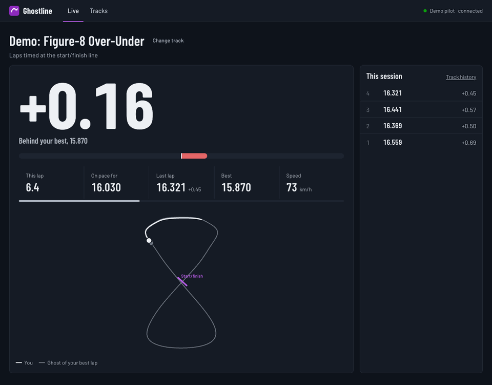
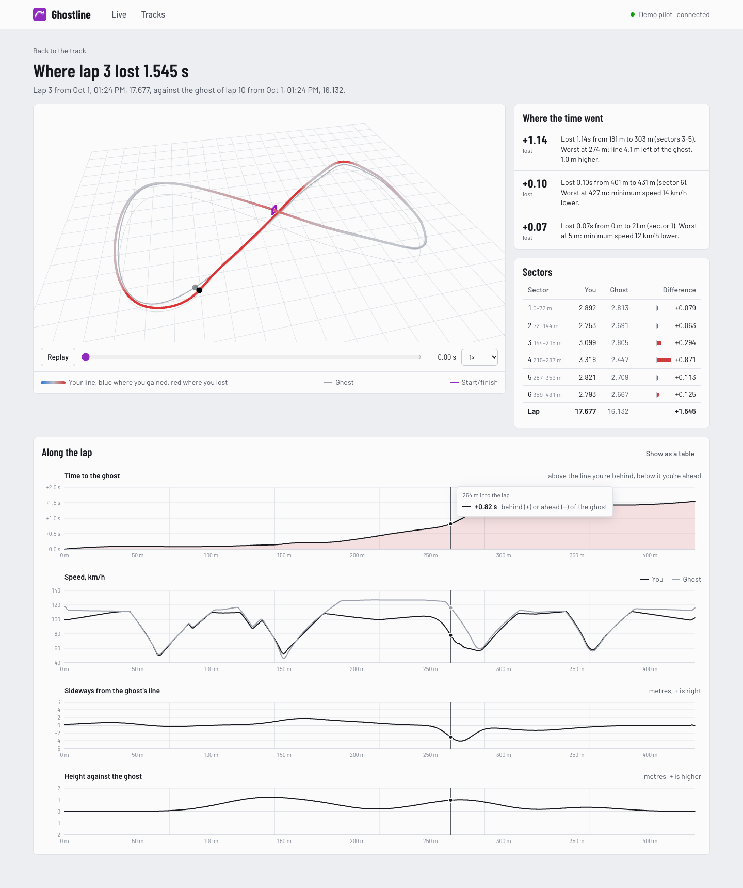
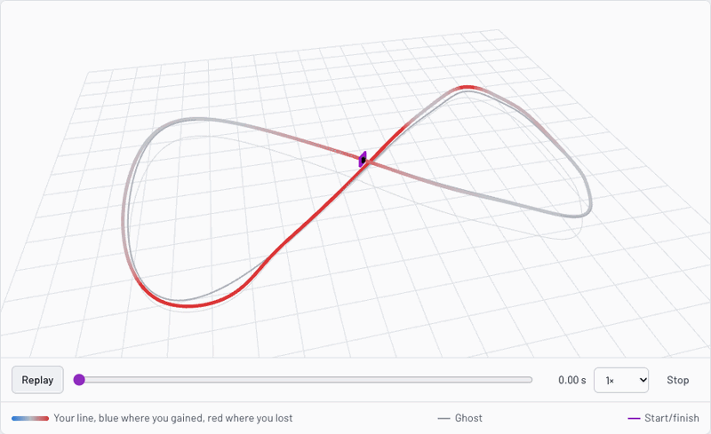
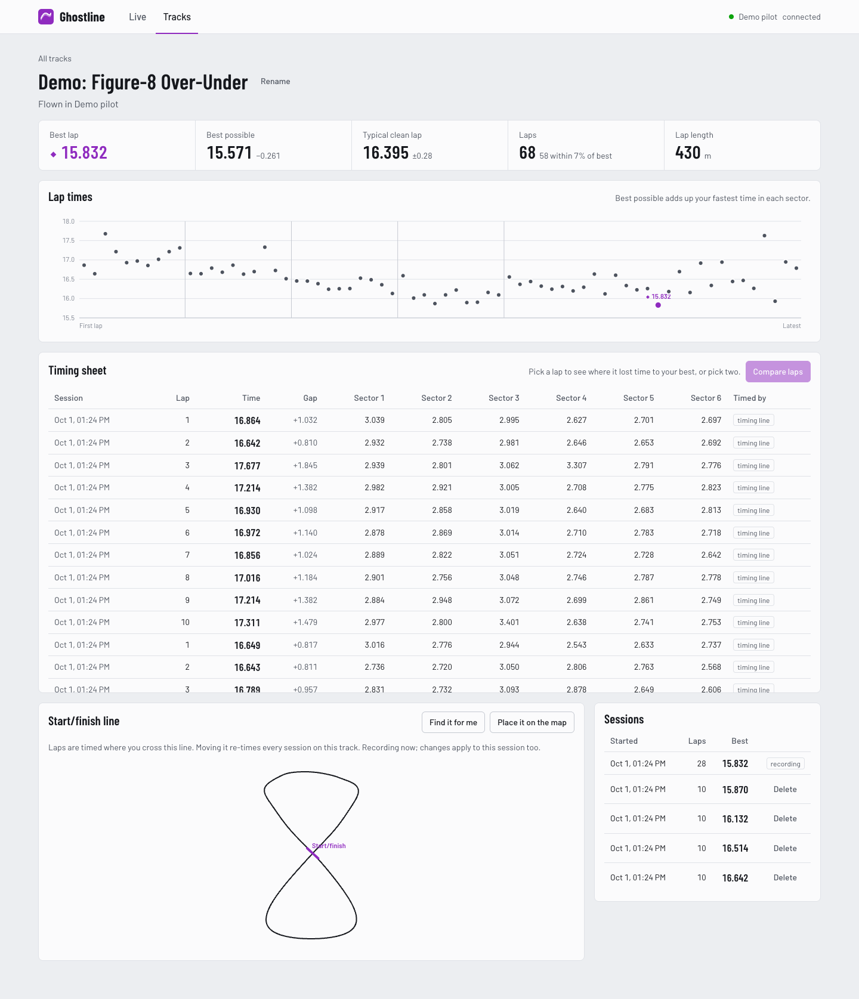
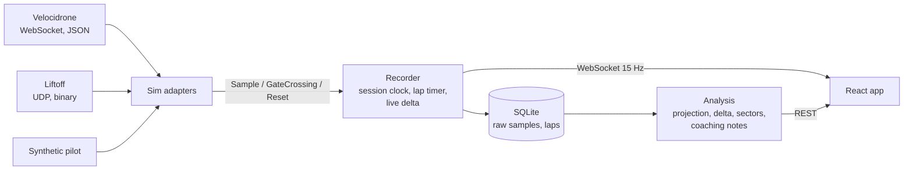

<div align="center">


# Ghostline

**An FPV race coach for Velocidrone and Liftoff.**<br/>
Race the ghost of your best lap while you fly, then see exactly where on the track you lost time, and why.

[](https://github.com/AndrewMse/ghostline/actions/workflows/ci.yml)


[Features](#features) · [How it works](#how-it-works) · [Quick start](#quick-start) · [Velocidrone](#with-velocidrone) · [Liftoff](#with-liftoff) · [Tests](#tests) · [Roadmap](#status-and-roadmap)

<br/>



<sub>The live view on a second screen, with the built-in demo pilot flying. No sim needed to try it.</sub>

</div>

---

## Features

|  |  |
| --- | --- |
| ⏱️ **Live delta** | A big number tells you how far ahead of or behind your best lap you are, 15 times a second, with the lap time you're on pace for. |
| 🏁 **Zero-config lap timing** | Uses Velocidrone's own gates in races. Everywhere else it finds the start/finish line from your flight path, or you click where it is on the map. |
| 📉 **Where the time went** | Compares any two laps by distance along the track, not by time, and writes up where you lost time in plain words. |
| 🛸 **3D ghost replay** | Both laps in 3D, your line coloured by where you gained and lost, with both drones flying side by side. |
| 📋 **Timing sheet** | Every lap with sector times, your best possible lap, and how consistent you are. |
| 🎮 **Two sims, one model** | Velocidrone (WebSocket, JSON) and Liftoff (UDP, binary) become the same events, so nothing downstream knows which sim it's looking at. |

### Where the time went

Pick any two laps. Ghostline lines them up metre by metre along the track and shows the time gap,
speed, and how far off the ghost's line you were sideways and in height. Then it explains the
biggest losses:

> *Lost 1.14s from 181 m to 303 m (sectors 3-5). Worst at 274 m: line 4.1 m left of the ghost, 1.0 m higher.*

<picture>
  <source media="(prefers-color-scheme: dark)" srcset="docs/compare-dark.png" />
  
</picture>

### 3D ghost replay

Your line is blue where you gained on the ghost and red where you lost. Scrub or play the replay
to watch both drones fly the lap together.

<p align="center">
  
</p>

### Every lap on a track

<picture>
  <source media="(prefers-color-scheme: dark)" srcset="docs/track-dark.png" />
  
</picture>

## Supported sims

|  | Velocidrone | Liftoff | Demo pilot |
| --- | --- | --- | --- |
| **Feed** | Local WebSocket, JSON | UDP, packed little-endian floats | Built in |
| **Lap timing** | Sim gates in races, auto-detected line in free flight | Auto-detected start/finish line | Auto-detected start/finish line |
| **Setup** | Two toggles in the game's options | `ghostline liftoff-config --write` | None |

## How it works



The backend is Python (FastAPI, NumPy, SQLite). The frontend is React + TypeScript with
hand-built SVG charts and a react-three-fiber 3D view.

### The interesting parts

**One data model for two sims** ([`sources/`](backend/ghostline/sources)). Velocidrone streams
JSON over a local WebSocket with some quirks: binary frames only, every value a string, a frame
parser that breaks on standard pings. Liftoff sends packed little-endian floats over UDP in a
user-configured field order. Each adapter turns its sim's feed into the same few events.

**The session clock** ([`recorder.py`](backend/ghostline/recorder.py)). Liftoff's timestamp
restarts at zero on every reset and Velocidrone's only runs while flying, so samples are stored on
a clock that always moves forward. Resets are also detected from clock jumps, pauses and
teleports, and a lap never spans one.

**Lap timing** ([`timing.py`](backend/ghostline/timing.py)). A virtual gate is a plane in space.
A lap boundary is the moment the path crosses it forwards within the gate's radius, interpolated
between frames for sub-frame accuracy. With no gate yet, `find_gate` tries candidate planes along
the first minute and a half of flying and keeps the one that produces the most laps of consistent
length. Live timing and re-timing stored sessions both run through the same `LapTimer`.

**Comparing laps by distance** ([`analysis.py`](backend/ghostline/analysis.py)). Every sample of
a lap is projected onto the reference lap's line, giving distance along the track plus sideways
and vertical offsets. The projection is a windowed forward search, so tracks that cross over
themselves (the demo track is a figure-8 with an over-under) don't jump to the wrong half of the
lap. From each lap's time-at-distance curve, `delta(s) = t_lap(s) - t_ghost(s)`. The coaching
notes are the stretches where the delta keeps growing or shrinking, explained by what happened at
their worst point.

<details>
<summary><b>Project layout</b></summary>

```
backend/ghostline/
├── sources/        sim adapters: velocidrone.py, liftoff.py, synthetic.py
├── models.py       the sim-agnostic events every adapter emits
├── recorder.py     session clock, reset detection, live delta
├── timing.py       virtual gates, lap detection, find_gate
├── analysis.py     distance projection, delta, sectors, coaching notes
├── db.py           SQLite storage (raw samples kept, so laps can be re-timed)
├── api.py          REST + live WebSocket (FastAPI)
├── synthetic.py    the demo track and pilot
└── cli.py          ghostline serve / seed-demo / liftoff-config
frontend/src/
├── pages/          Live, Tracks, Track, Compare
└── components/     SVG charts, track map, react-three-fiber 3D view
```

</details>

## Quick start

Needs Python 3.11+ and Node 22+.

```sh
# backend
cd backend
python3 -m venv .venv && source .venv/bin/activate
pip install -e ".[dev]"

# frontend (built once, then served by the backend)
cd ../frontend
npm install && npm run build

# try it without a sim: three recorded sessions plus a live synthetic pilot
cd ../backend
ghostline seed-demo
ghostline serve --source demo
```

Open http://127.0.0.1:8000.

For frontend development, run `npm run dev` in `frontend/` and open http://localhost:5173 (it
proxies `/api` to the backend).

### With Velocidrone

1. In Velocidrone: *Options → Main Settings*, turn on **Websocket Communication** and
   **Websocket IMU**. The IMU feed needs the Betaflight flight controller model.
2. `ghostline serve --source velocidrone`. The game only listens on the PC's LAN address, which is
   found automatically; if the sim runs on another PC, pass `--vd-host <its LAN IP>`.
3. In multiplayer, pass `--vd-pilot <your name>` so Ghostline knows which laps are yours.

Velocidrone only sends the track name when you host a room, so name the track on the Live page.

### With Liftoff

1. `ghostline liftoff-config --write` writes Liftoff's `TelemetryConfiguration.json` (an existing
   one is backed up).
2. `ghostline serve --source liftoff`, then reset your drone in Liftoff so it reloads the file.

## Tests

```sh
cd backend && pytest     # 33 tests: parsers, timing, analysis, recorder, API
cd frontend && npm run lint && npm run build
```

The tests use the synthetic pilot, including a fake Velocidrone server that speaks the game's
WebSocket dialect. CI runs both on every push.

## Status and roadmap

- Built and tested against the documented telemetry formats and the synthetic pilot. It hasn't
  been checked against a live sim session yet. Two assumptions to confirm on real data:
  Liftoff's throttle range (read as -1 to 1), and Velocidrone's gyro units.
- Velocidrone IMU telemetry needs the Betaflight flight controller model in the sim.

Next up:

- [ ] Import Betaflight blackbox logs from real quads
- [ ] Stick-input analysis (Liftoff sends stick positions)
- [ ] Crash detection

## Credits

The Velocidrone WebSocket details come from the community's reverse-engineered protocol notes
(see [splitter](https://github.com/ryan-johnson2/splitter), a Velocidrone lap timer), and the
Liftoff stream format from the official Steam guide *Liftoff - Drone Telemetry*.
